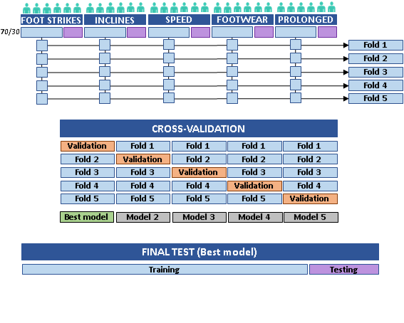

# FootNet development

FootNet cross-validation and testing can be replicated on Google Colab (see figure). You will need to download the processed datasets from [here](https://drive.google.com/drive/folders/1MMpsXvz8-rDjTwwfOrp_k7zS_Om1gqLy?usp=sharing) (THIS IS A TEMPORARY SOLUTION WHILE WE DON'T DECIDE WHETHER WE GO FIGSHARE OR UNI REPO. FOR NOW, CLICK ON THE LINK, THEN ON THE TOP TAB CALLED StepDetectionStudy YOU'LL SEE A DROPDOWN ARROW, CLICK ON IT AND DOWNLOAD. THAT WILL DOWNLOAD EVERYTHING AS A ZIP FOLDER. ONCE THAT'S FINISHED, OPEN THE FOLDER IN YOUR COMPUTER AND REUPLOAD THE FOLDER StepDetectionStudy CONTAINING EVERYTHING TO MY DRIVE IN YOUR GOOGLE DRIVE) and the Google Colab notebooks to replicate the development of Footnet can be found in this repository.

 CAN'T GET RELATIVE LINKS TO WORK

The project directory StepDetectionStudy is organised as follows:

  - StepDetectionStudy
    - Data
      - OriginalDatasets. Folder containing the entire datasets (*_dataset.npy files).
      - DataFolds.npy File containing the training data grouped in 5 folds.
      - TestingSet.npy File containing the testing set.
      
      Data are organised as Python dictionaries containing the kinematic input features ['X'], label vectors ['Y'], metadata about the trials ['meta'] and vertical GRF ['GRFv']. Each of those dictionary keys contains a list with nested lists with the structure participant > trial > stride. For instance, dataset['X'][0][0][0] accesses the kinematic input features characterising the first stride recorded in the first trial of the first participant in dataset.
      
    - CrossValidation
      - Models. Folder containing the five models developed during cross validation.
      - Results. Folder containing the summary performance metrics for each model on its corresponding validation set and Bland-Altman plots comparing foot strike, toe off and contact times as predicted by FootNet vs gold standard method.
    - FinalTest
      - FootNet_best_candidate. Best set of parameters resulting from cross validation.
      - Summary performance metrics on testing set and Bland-Altman plots comparing foot strike, toe off and ocntact times as predicted by FootNet vs gold standard method.
      - y_and_yhat.mat File containing testing predictions, target labels and metadata from testing stride cycles for posterior analyses in Matlab presented in the paper.
    - FinalModel. Folder containing the final updated model resulting from FinalTest as a SavedModel directory (Tensorflow model format) and as .h5.

Once the project folder is in your Google Drive, you can use the Google Colab [notebooks](https://github.com/adrianrivadulla/FootNet/tree/main/notebooks):

CAN'T GET RELATIVE LINKS TO WORK

   - [TrainTest_Split.ipynb.](https://github.com/adrianrivadulla/FootNet/blob/main/notebooks/TrainTest_Split.ipynb) This notebook demonstrates how the dataset splitting was performed, including training and testing (70/30) and further folding of training dataset in 5 folds.
   - [CrossValidation.ipnyb.](https://github.com/adrianrivadulla/FootNet/blob/main/notebooks/StepDetection_CV.ipynb) This notebook performs 5-fold cross-validation and selects the best set of weights as best candidate for the final test.
   - [FinalTest.ipnyb.](https://github.com/adrianrivadulla/FootNet/blob/main/notebooks/StepDetection_FinalTest.ipynb) This notebook updates the best candidate model resulting from cross-validation with the 5 folds as training set and performs the final test on the testing set.

You can preview the notebooks on Github but I am not sure you can run them from here without any issues. I would recommend opening the notebook in Google Colab to have full control over it. This option should appear at the top of your screen when you click on a given Google Colab notebook. Google Colab is pretty easy to use and there are [plenty of resources online to get you started](https://towardsdatascience.com/getting-started-with-google-colab-f2fff97f594c). To run the notebooks provided here, open the notebook, click on the Runtime tab and click Run all, which will start running all the code cells in the notebook. You will be asked to mount your Google drive. Scroll down to the Mount drive cell and it will guide you through the process. **For CrossValidation.ipynb and FinalTest.ipynb, make sure you are running on GPU by clicking on Runtime > Change Runtime type and selecting GPU.** Google Colab connects you to a virtual machine where the code is run and your time connected to this machine is limited to 12 hours. It is not guaranteed that cross-validation (i.e. training five models) can finish under 12 hours without using a GPU. Note that successfull execution of the notebooks will make changes to the files provided in the project folder within your Google drive.

